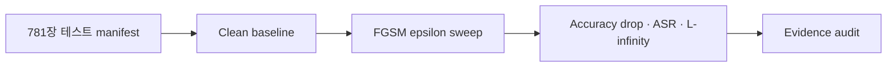

# 자율운항선박 이미지 분류 모델 적대적 AI 검증


> 선박 이미지 분류 모델의 정상 인식, FGSM 교란, 연구근거 감사를 하나의 재현 가능한 흐름으로 검증합니다. 위 이미지는 연구 개념을 표현한 것이며 실시간 선박 제어·운영 시스템의 구현 화면이 아닙니다.

2026 스마트해운물류 × ICT 멘토링

## 한눈에 보는 현재 상태

| 구분 | 상태 | 확인된 범위 |
|---|---:|---|
| Clean baseline | ✅ 검증 완료 | CNN·MobileNetV2, 테스트셋 781장 |
| FGSM 구현 | ✅ 검증 완료 | 부호·clipping·$L_\infty \leq \epsilon + 10^{-6}$·$\epsilon=0$ 계약 |
| FGSM 수치 | 🟡 예비 결과 | $\epsilon=0, 0.01, 0.03, 0.05$; 멘토 승인 전 provisional |
| 연구근거 감사 | ✅ 검증 완료 | manifest·모델 해시·CSV·JSON·문서 간 일관성 |
| BIM·PGD·JSMA·방어 | ⚪ 향후 연구 | 미구현·미검증 |
| VLM/LLM·안전영향 시뮬레이터 | ⚪ 목표 범위 | 현재 실증 완료 기능이 아님 |

## 검증 흐름



- **Clean:** 공격 전 모델 성능을 고정 테스트셋에서 재현
- **Attack:** 입력을 `[0,1]` 범위로 제한하고 FGSM 교란 크기를 검증
- **Metrics:** ASR은 Clean에서 정답이었던 표본만 분모로 사용
- **Audit:** canonical CSV·JSON·manifest로 논문 주장을 다시 계산하고 변조 시 실패

## 검증된 핵심 수치

| 모델 | Clean correct | Clean accuracy |
|---|---:|---:|
| CNN | 504 / 781 | 0.6453264951705933 |
| MobileNetV2 | 613 / 781 | 0.7848911881446838 |

> FGSM 결과는 현재 **provisional**입니다. 공식 epsilon 범위 승인 후 별도 공식 결과 경로에서 재실행합니다.

상세 근거: [`docs/CLEAN_BASELINE_RESULTS.md`](docs/CLEAN_BASELINE_RESULTS.md) · [`docs/FGSM_PROVISIONAL_RESULTS.md`](docs/FGSM_PROVISIONAL_RESULTS.md)

## 프로젝트에서 증명한 역량

| 문제와 판단 | 수행 내용 | 확인 가능한 근거 | 실무 연결 |
|---|---|---|---|
| 공격 전 기준 성능이 고정되지 않으면 취약성 비교가 흔들린다고 판단 | 동일한 781장 manifest로 CNN·MobileNetV2 Clean 성능을 재현 | Clean 정본 결과, 데이터·모델 SHA-256 | AI 모델 검증·실험 재현성 |
| 공격 성공률만으로는 구현 오류를 놓칠 수 있음 | clipping·섭동 한계·epsilon 0·Clean-correct 분모를 계약과 테스트로 고정 | FGSM 계약, 단위·변이 테스트 | 적대적 테스트·보안 품질보증 |
| 예비 결과가 공식 주장으로 섞이는 위험을 통제 | provisional/official 경계와 논문 Claim 감사를 자동화 | canonical CSV·JSON, Claim 감사 7/7 | 연구근거 관리·감사 가능한 문서화 |

> **역할 경계:** 최희찬은 통합 범위와 공식 결과 전환 기준을 정하고 Windows에서 전체 데이터·모델 재현 검증을 수행했습니다. Codex와 다른 기여자의 구현 범위는 [기여 기록](CONTRIBUTIONS.md)에 각각 명시합니다.

## 연구 질문

> 선박 이미지 분류 모델은 입력 교란에 얼마나 취약하며, 모델 구조에 따라 Clean 성능·공격 성공률·강건성 저하가 어떻게 달라지는가?

현재 논문 근거로 사용하는 범위는 **Clean baseline과 FGSM 검증**입니다. 공공 AIS 데이터, VLM/LLM, BIM·PGD·JSMA 및 방어기법은 현재 결과의 근거로 연결하지 않습니다.

## 실험 계약

- 테스트 표본: 781장, 10개 클래스
- 평가 입력 명세: `rescale=1./255`, `[0,1]`
- FGSM: untargeted 기준 `x_adv = clip(x + epsilon * sign(grad_x L), 0, 1)`
- 허용오차: `L_infinity <= epsilon + 1e-6`
- epsilon 0: accuracy drop·ASR·최대 L-infinity 모두 0
- ASR 분모: Clean-correct 표본
- 학습 당시 전처리·분할·seed 미확정 사항은 확정 사실로 주장하지 않음

계약 원문: [`docs/EXPERIMENT_CONTRACT.md`](docs/EXPERIMENT_CONTRACT.md)

## 재현 및 감사

```bash
export PYTHONPATH=src
python -m pytest -q
python scripts/audit_research_evidence.py
python scripts/audit_paper_claims.py
```

Windows CMD:

```bat
set PYTHONPATH=src
python -m pytest -q
python scripts\audit_research_evidence.py
python scripts\audit_paper_claims.py
```

- 연구근거 감사: [`docs/RESEARCH_EVIDENCE_AUDIT.md`](docs/RESEARCH_EVIDENCE_AUDIT.md)
- 논문 Claim 감사: [`docs/PAPER_CLAIM_AUDIT.md`](docs/PAPER_CLAIM_AUDIT.md)
- 데이터·모델 배치: [`docs/REPRODUCIBILITY.md`](docs/REPRODUCIBILITY.md)

## 저장소 구조

```text
configs/                      클래스·테스트 manifest·실험 설정
docs/                         범위·실험계약·결과·재현성 문서
src/adversarial_ai/           공격·평가·무결성·감사 패키지
scripts/                      감사 및 실험 실행 진입점
tests/                        계약·무결성·변조 탐지 테스트
results/clean/                canonical Clean 결과
results/attacks/provisional/  멘토 승인 전 FGSM 예비 결과
results/audit/                감사 보고서
```

## 주장 경계

### 구현·검증 완료

- CNN·MobileNetV2 Clean 평가
- FGSM 공격 및 epsilon 0 통제
- 테스트 이미지 781장·모델 SHA-256 무결성 확인
- Clean/FGSM 근거 및 논문 Claim 감사

### 아직 공식 결과가 아닌 항목

- epsilon별 FGSM 예비 수치
- 학습 당시 실제 전처리·분할 비율·random seed

### 향후 연구

- BIM·PGD·JSMA 및 방어기법
- 전이 공격과 인과적 안전성 검증
- VLM/LLM 해양맥락 및 연구용 안전영향 시뮬레이터

범위와 Decision Gate: [`docs/PROJECT_SCOPE.md`](docs/PROJECT_SCOPE.md) · [`docs/CAUSAL_SECURITY_VALIDATION.md`](docs/CAUSAL_SECURITY_VALIDATION.md)

## 기여 및 역할

구현·검증·데이터 분석·리뷰의 출처와 역할은 [`CONTRIBUTIONS.md`](CONTRIBUTIONS.md)에 기록합니다. 직무 연계와 인터뷰 시 주장 가능한 범위는 [`docs/ROLE_ALIGNMENT.md`](docs/ROLE_ALIGNMENT.md)를 참조하세요.
