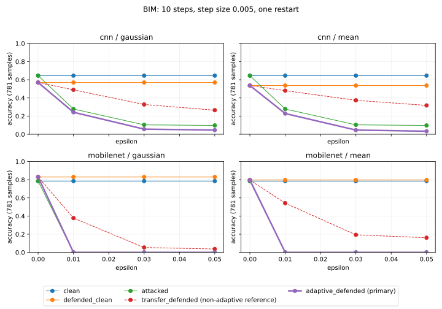

# BIM GPU 저장 결과 요약

실행 `full-gpu-20261004T120332`의 BIM 16조건을 원시 CSV와 대조해 검산했다. 각 조건은 같은 테스트 781장을 사용한다. 외부 독립검증 승인은 수행하지 않았다.

| 모델 | 필터 | ε | 공격 정확도 | 전달 방어 정확도 | 방어 인지 정확도 |
|---|---|---:|---:|---:|---:|
| cnn | gaussian | 0.0 | 0.6453 | 0.5698 | 0.5698 |
| cnn | gaussian | 0.01 | 0.2778 | 0.4891 | 0.2420 |
| cnn | gaussian | 0.03 | 0.1037 | 0.3278 | 0.0563 |
| cnn | gaussian | 0.05 | 0.0973 | 0.2650 | 0.0461 |
| cnn | mean | 0.0 | 0.6453 | 0.5365 | 0.5365 |
| cnn | mean | 0.01 | 0.2778 | 0.4802 | 0.2279 |
| cnn | mean | 0.03 | 0.1037 | 0.3739 | 0.0461 |
| cnn | mean | 0.05 | 0.0973 | 0.3175 | 0.0333 |
| mobilenet | gaussian | 0.0 | 0.7849 | 0.8297 | 0.8297 |
| mobilenet | gaussian | 0.01 | 0.0000 | 0.3777 | 0.0000 |
| mobilenet | gaussian | 0.03 | 0.0000 | 0.0538 | 0.0000 |
| mobilenet | gaussian | 0.05 | 0.0000 | 0.0371 | 0.0000 |
| mobilenet | mean | 0.0 | 0.7849 | 0.7964 | 0.7964 |
| mobilenet | mean | 0.01 | 0.0000 | 0.5416 | 0.0000 |
| mobilenet | mean | 0.03 | 0.0000 | 0.1933 | 0.0000 |
| mobilenet | mean | 0.05 | 0.0000 | 0.1613 | 0.0000 |

전달 방어는 원본 모델을 공격한 뒤 필터를 적용하고, 방어 인지 공격은 필터를 포함한 모델을 공격한다. 두 결과를 같은 방어 성능으로 해석하지 않는다. ε=0은 대조군이다. ASR의 분모는 해당 기준 파이프라인에서 정답인 표본 수이며 `metrics.csv`에 함께 기록했다.

이 표는 BIM 설정에 한정된다. PGD·JSMA·적대적 학습의 완료나 일반적인 강건성을 증명하지 않는다. 확률 배열 비교와 실제 선박 환경 검증도 포함하지 않는다.
